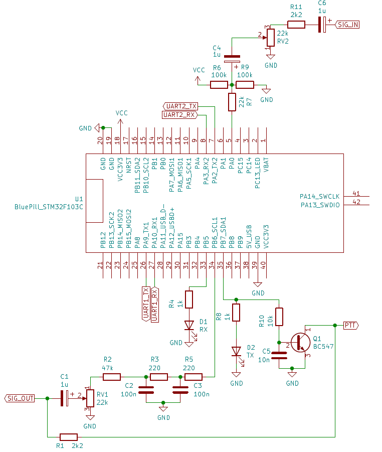

# VP-Digi - documentation
Copyright 2023 Piotr Wilkoń\
Permission is granted to copy, distribute and/or modify this document under the terms of the GNU Free Documentation License, Version 1.3 or any later version published by the Free Software Foundation; with no Invariant Sections, no Front-Cover Texts, and no Back-Cover Texts.  A copy of the license is available under [LICENSE_FDL](LICENSE_FDL).\
The changelog is placed at the bottom of this document.
## Table of contents
- [VP-Digi - documentation](#vp-digi---documentation)
  - [Table of contents](#table-of-contents)
  - [1. Functional description](#1-functional-description)
  - [2. User manual](#2-user-manual)
    - [2.1. Configuration mode](#21-configuration-mode)
      - [2.1.1. Commands](#211-commands)
      - [2.1.2. Example configuration](#212-example-configuration)
    - [2.2. Monitor mode](#22-monitor-mode)
      - [2.2.1. Commands](#221-commands)
      - [2.2.2. Received packet view](#222-received-packet-view)
    - [2.3. KISS mode](#23-kiss-mode)
    - [2.4. Signal level setting](#24-signal-level-setting)
    - [2.5. Programming](#25-programming)
      - [2.5.1. Programming using an ST-Link programmer](#251-programming-using-an-st-link-programmer)
      - [2.5.2. Programming using a USB-UART adapter](#252-programming-using-a-usb-uart-adapter)
    - [2.6. Setup](#26-setup)
  - [3. Technical description](#3-technical-description)
    - [3.1. Hardware](#31-hardware)
      - [3.1.1. Reception](#311-reception)
      - [3.1.2. Transmission](#312-transmission)
    - [3.2. Software](#32-software)
      - [3.2.1. Modem](#321-modem)
        - [3.2.1.1. Demodulation](#3211-demodulation)
        - [3.2.1.2. Modulation](#3212-modulation)
        - [3.2.1.3. Bit recovery](#3213-bit-recovery)
      - [3.2.2. Protocols](#322-protocols)
        - [3.2.2.1. Reception](#3221-reception)
        - [3.2.2.2. Transmission](#3222-transmission)
      - [3.2.3. Digipeater](#323-digipeater)
  - [4. Documentation changelog](#4-documentation-changelog)
    - [2023/09/06](#20230906)

## 1. Functional description
VP-Digi is a standalone AX.25 digipeater controller (e.g., APRS) and a KISS TNC controller. The software is equipped with the following modems:
- Bell 202 AFSK 1200 Bd 1200/2200 Hz (VHF standard)
- G3RUH GFSK 9600 Bd (UHF standard)
- Bell 103 AFSK 300 Bd 1600/1800 Hz (HF standard)
- V.23 AFSK 1200 Bd 1300/2100 Hz (alternative VHF standard)

Each modem utilizes carrier detection based on detecting the correct modulating signal rather than decoded data, increasing reliability and reducing collisions.

Furthermore, the software supports the following protocols:
- AX.25 (Packet Radio/APRS standard)
- FX.25 - AX.25 with error correction, fully compatible with AX.25

VP-Digi allows configuration of:
- Your own callsign, SSID, and destination address
- Modem parameters (*TXDelay*, *TXTail*, quiet time, DAC type, receiver type)
- Serial port baud rates
- 4 digipeater aliases of the *New-N* type (e.g., *WIDEn-N*)
- 4 simple digipeater aliases (e.g., *CITY*)
- Hop count thresholds for *New-N* type aliases
- Enabling tracing for each alias
- *Viscous delay* mode and *direct only* mode for each alias
- Filtering lists (excluding or including)
- Enabling reception of non-APRS packets
- Enabling monitoring of own packets through the KISS port

The device provides:
- 2 serial ports
- USB port

Each port operates independently and can function in the following modes:
- TNC KISS
- Frame monitor
- Configuration terminal

## 2. User manual
### 2.1. Configuration mode
Device configuration can be done through any port (USB, UART1, UART2). To enter configuration mode, use the `config` command.
> Note! If the port is in KISS mode (default after startup), the entered characters will not be visible.

> Note! After completing the configuration, remember to save it to memory using the `save` command.

#### 2.1.1. Commands
The following commands are available in configuration mode:
- `call CALLSIGN-SSID` - sets the callsign along with SSID. The callsign must consist of a maximum of 6 A-Z and 0-9 characters. SSID is optional and must be within the range of 0-15.
- `dest ADDRESS` – sets the destination address. The address must consist of a maximum of 6 A-Z and 0-9 characters , without SSID. *APNV01* is the official and recommended address for VP-Digi.
- `modem <1200/300/9600/1200_V23>` - sets the modem type: *1200* for 1200 Bd modem, *300* for 300 Bd modem, *9600* for 9600 Bd modem, or *1200_V23* for the alternative 1200 Bd modem.
- `txdelay TIME` – sets the preamble length before transmitting a frame. Value in milliseconds, ranging from 30 to 2550.
- `txtail TIME` – sets the tail length after a frame transmission. Value in milliseconds, ranging from 10 to 2550. Set to the minimum value if not needed.
- `quiet TIME` – sets the time that must elapse between channel release and transmission start. Value in milliseconds, ranging from 100 to 2550.
- `uart NUMBER baud RATE` - sets the baud rate (1200-115200 Bd) for the selected serial port.
- `uart NUMBER mode <kiss/monitor/config>` - sets the default operating mode for the selected serial port (0 for USB).
- `pwm <on/off>` – sets the DAC type. *on* when a PWM filter is installed, *off* when an R2R ladder is installed. Starting from version 2.0.0, it is recommended to use only PWM.
- `flat <on/off>` – configures the modem for use with a radio with *flat audio* output. *on* when the signal is fed from the *flat audio* connector, *off* when the signal is fed from the headphone jack. This option only affects 1200 Bd modems.
- `beacon NUMBER <on/off>` – *on* activates, *off* deactivates the beacon with the specified number, ranging from 0 to 7.
- `beacon NUMBER iv TIME` – sets the beacon transmission interval (in minutes) for the beacon with the specified number, ranging from 0 to 7.
- `beacon NUMBER dl TIME` – sets the delay/offset for beacon transmission (in minutes) for the beacon with the specified number, ranging from 0 to 7.
- `beacon NUMBER path PATHn-N[,PATHn-N]/none` – sets the beacon path for the beacon with the specified number, ranging from 0 to 7. The command accepts one (e.g., *WIDE2-2*) or two (e.g., *WIDE2-2,MA3-3*) path elements or the *none* option for no path.
- `beacon NUMBER data CONTENT` – sets the content of the beacon with the specified number, ranging from 0 to 7.
- `digi <on/off>` – *on* enables, *off* disables the digipeater.
- `digi NUMBER <on/off>` – *on* enables, *off* disables the handling of the alias with the specified number, ranging from 0 to 7.
- `digi NUMBER alias ALIAS` – sets an alias with the specified number, ranging from 0 to 7. For slots 0-3 (type *n-N*), it accepts up to 5 characters without SSID, and for slots 4-7 (simple aliases), it accepts aliases in the form of callsigns with SSID or without.
- `digi NUMBER max N` – sets the maximum *n* (ranging from 1 to 7) for normal repeating of *n-N* type aliases (ranging from 0 to 3).
- `digi NUMBER rep N` – sets the minimum *n* (ranging from 0 to 7) from which *n-N* type aliases (ranging from 0 to 3) will be processed as simple aliases. Setting *N* to 0 disables this feature.
- `digi NUMBER trac <on/off>` – sets the selected alias (ranging from 0 to 7) as traceable (*on*) or non-traceable (*off*).
- `digi NUMBER viscous <on/off>` – *on* enables, *off* disables the *viscous delay* function for the alias with the specified number, ranging from 0 to 7.
- `digi NUMBER direct <on/off>` – *on* enables, *off* disables the function of repeating only frames received directly for the alias with the specified number, ranging from 0 to 7.
> The operation of the digipeater is described in [section 3.2.3](#323-digipeater).
- `digi NUMBER filter <on/off>` – *on* enables, *off* disables frame filtering for the alias with the specified number, ranging from 0 to 7.
- `digi filter <black/white>` – sets the type of frame filtering list: *black* (exclusion - frames from characters on the list will not be repeated) or *white* (inclusion - only frames from characters on the list will be repeated).
- `digi dupe TIME` – sets the duplicate filtering buffer time, preventing multiple repetitions of a previously repeated packet. Time in seconds, ranging from 5 to 255.
- `digi list POSITION set CALLSIGN-SSID` – enters a call sign into the selected position (ranging from 0 to 19) of the filtering list. You can use \* to mask all characters to the end of the call sign. *?* masks a single letter in the call sign. To mask the SSID, you can use \* or *?*.
- `digi list POSITION remove` – removes the selected position (ranging from 0 to 19) from the filtering list.
- `monkiss <on/off>` – *on* enables, *off* disables sending own and repeated frames to KISS ports.
- `nonaprs <on/off>` – *on* enables, *off* disables the reception of non-APRS packets (e.g., for Packet Radio).
- `fx25 <on/off>` - *on* enables, *off* disables FX.25 protocol support. When enabled, both AX.25 and FX.25 packets will be received simultaneously.
- `fx25tx <on/off>` - *on* enables, *off* disables transmission using the FX.25 protocol. If FX.25 support is completely disabled (command *fx25 off*), packets will always be transmitted using AX.25.

Additionally, there are control commands available:
- `print` – displays the current settings.
- `list` – displays the contents of the filtering list.
- `save` – saves the settings to memory and restarts the device. Always use this command after completing configuration. Otherwise, unsaved configuration will be discarded.
- `eraseall` – clears the entire configuration and restarts the device.

Common commands are also available:
- `help` – displays the help page.
- `reboot` – restarts the device.
- `version` – displays software version information.
- `monitor` – switches the port to monitor mode.
- `kiss` – switches the port to KISS mode.

#### 2.1.2. Example configuration

- Beacon\
    Example for beacon number 0. Beacons are available from 0 to 7.
    1. *beacon 0 data !5002.63N/02157.91E#VP-Digi* – setting APRS standard beacon data
    2. *beacon 0 path WIDE2-2* – setting the path
    3. *beacon 0 iv 15* – transmitting every 15 minutes
    4. *beacon 0 dl 5* – the beacon will be transmitted for the first time after 5 minutes from device startup
    5. *beacon 0 on* – enabling the beacon

- Fill-in WIDE1-1 digipeater\
    Example for alias number 0. Alias numbers range from 0 to 3.
    1. *digi 0 alias WIDE* – repeating WIDEn-N type aliases. Numbers n and N are NOT set here.
    2. *digi 0 max 1* – repeating paths up to a maximum of WIDE1-1
    3. *digi 0 rep 0* – disabling path limiting and simplification
    4. *digi 0 trac on* – enabling path tracing (WIDEn-N paths are traced)
    5. *digi 0 on* – enabling handling of the alias
    6. *digi on* – enabling the digipeater

- Fill-in digipeater with *viscous delay* (recommended configuration)\
    Example for alias number 0. Alias numbers range from 0 to 3.
    1. *digi 0 alias WIDE* – repeating WIDEn-N type aliases. Numbers n and N are NOT set here.
    2. *digi 0 max 2* – repeating paths up to a maximum of WIDE2-2
    3. *digi 0 rep 3* – WIDE3-3 and longer paths will be simplified when repeated
    4. *digi 0 trac on* – enabling path tracing (WIDEn-N paths are traced)
    5. *digi 0 viscous on* – enabling the *viscous delay* mode
    6. *digi 0 on* – enabling handling of the alias
    7. *digi on* – enabling the digipeater

- Regional WIDEn-N + MAn-N digipeaters (recommended configuration)\
    Examples for aliases 0 (for WIDE) and 1 (for MA).
    1. *digi 0 alias WIDE* – repeating WIDEn-N type aliases. Numbers n and N are NOT set here.
    2. *digi 0 max 2* – repeating paths up to a maximum of WIDE2-2
    3. *digi 0 rep 3* – WIDE3-3 and longer paths will be simplified when repeated
    4. *digi 0 trac on* – enabling path tracing (WIDEn-N paths are traced)
    5. *digi 0 on* – enabling handling of the alias
    6. *digi 1 alias MA* – repeating MAn-N type aliases. Numbers n and N are NOT set here.
    7. *digi 1 max 7* – repeating paths up to a maximum of SP7-7
    8. *digi 1 rep 0* – no path hop limiting
    9. *digi 1 trac off* – disabling path tracing (regional paths are not traced)
    10. *digi 1 on* – enabling handling of the alias
    11. *digi on* – enabling the digipeater

### 2.2. Monitor mode

Device operation can be observed through any port (USB, UART1, UART2). Switching to monitor mode is done by issuing the `monitor` command.
> Note! If the port is in KISS mode (default after startup), entered characters will not be visible.

In monitor mode, received and transmitted packets are displayed, and it is also possible to perform signal level calibration.

#### 2.2.1. Commands

The following commands are available:

- `beacon NUMBER` - transmits a beacon from 0 to 7 if that beacon is enabled.
- `cal <low/high/alt/stop>` - starts or stops calibration mode: *low* transmits a low tone, *high* transmits a high tone, *alt* transmits zero bytes/alternating tones, and *stop* stops transmission. For the 9600 Bd modem, zero bytes are always transmitted.

Common commands are also available:

- `help` – displays the help page.
- `reboot` – restarts the device.
- `version` – displays software version information.
- `config` – switches the port to configuration mode.
- `kiss` – switches the port to KISS mode.
  
#### 2.2.2. Received packet view

For each received AX.25 packet, the header is displayed in the following format:
> Frame received [...], signal level XX% (HH%/LL%)
> 
For each received FX.25 packet, the format is as follows:
> Frame received [...], N bytes fixed, signal level XX% (HH%/LL%)

Where:
- *...* specifies which modems received the packet and what type of filter was used. The following statuses are possible:
  - *P* - high tone pre-emphasis filter
  - *D* - high tone de-emphasis filter
  - *F* - flat filter
  - *N* - no filter
  - *_* - modem did not receive the frame\
For example, the status *[_P]* indicates that the first modem did not receive the frame, and the second modem received the frame and uses a pre-emphasis filter. Another example status *[N]* means that only one modem without a filter is available, and it received the frame.
- *N* specifies how many bytes were fixed by the FX.25 protocol. This field is not displayed for AX.25 packets.
- *XX%* indicates the signal level, i.e., its amplitude.
- *HH%* indicates the level of the upper peak of the signal.
- *LL%* indicates the level of the lower peak of the signal.
> Note! The level of the upper peak should be positive, and the level of the lower peak should be negative. Furthermore, these levels should be symmetrical with respect to zero. A large imbalance indicates incorrect polarization of the ADC input.

### 2.3. KISS mode
KISS mode is used for working as a standard TNC KISS, compatible with many Packet Radio, APRS, and similar programs. In this mode, there is no echo (typed characters are not displayed). The available commands for switching modes are:
- `monitor` – switches the port to monitor mode
- `config` – switches the port to configuration mode

### 2.4. Signal level setting
After device startup, you should enter monitor mode (using the `monitor` command) and wait for packets to appear. You should adjust the signal level so that most packets have a signal level of around 50% (as described in [section 2.2.2](#222-received-packet-view)). The received signal level should be maintained within the range of 10-90%.\
The correct setting of the audio output type from the transceiver using the `flat <on/off>` command is crucial for the performance of the 1200 Bd modem. If you are using the headphone/speaker output (filtered), this option should be set to *off*. If you are using the *flat audio* output (unfiltered), this option should be set to *on*. This setting does not affect modems other than 1200 Bd.\
To ensure the best network performance, the transmitted signal level should also be properly set. This is especially important for the 1200 Bd modem, where the signal is transmitted through the standard microphone connector of an FM radio. Excessive signal levels can lead to distortion and significant tone amplitude imbalances.
Signal calibration requires an FM receiver tuned to the same frequency as the transmitter. You should enter monitor mode (using the `monitor` command) and enable high tone transmission (using the `cal high` command). You should set the potentiometer to the minimum amplitude level position and then slowly increase the level while carefully monitoring the signal strength in the receiver, which should increase. At some point, the signal level will stop increasing. At that point, gently retract the potentiometer and turn off the calibration mode (using the `cal stop` command). After this operation, the transmitter should be correctly driven.
> Note! If you fail to reach the point where the signal level stops increasing, the resistor value in the TX path is probably too high. If the signal level is clearly too low, reduce the value of this resistor. Otherwise, no action is necessary.

### 2.5. Programming
Programming (flashing firmware) can be done in two ways: using an ST-Link programmer or through the UART1 serial port (e.g., using a USB-UART adapter).
In both methods, you need to download the VP-Digi software (HEX file) beforehand.

#### 2.5.1. Programming using an ST-Link programmer
1. Download and install the *ST-Link Utility* program along with the appropriate drivers.
2. Connect VP-Digi to the programmer.
3. Connect the programmer to the USB port.
4. In *ST-Link Utility*, go to *File->Open file* and select the downloaded HEX file with the firmware.
5. Go to *Target->Program & Verify* and click *Start*. After a while, the device will restart, and the actual software will start.

#### 2.5.2. Programming using a USB-UART adapter
1. Ensure that the adapter works with logic levels of 0/3.3V.
2. If necessary, install drivers for the adapter.
3. Download and install the *Flasher-STM32* program.
4. On the board, set the jumper closer to the reset button to position 0, and the one farther away to 1.
5. Connect the *TX* pin of the adapter to the *PA10* pin and *RX* to *PA9*. Connect power (e.g., from the adapter).
6. Determine which COM port the adapter is available on.
7. Start *Flasher-STM32*, select the appropriate COM port, and click *Next*.
   > If an error occurs, reset the microcontroller and check the connections and jumper settings.
8. On the next screen, click *Next*.
9. On the following screen, select the option *Download to device* and choose the downloaded HEX file.
10. Check the options *Erase necessary pages* and *Verify after download*, then click *Next*. After a moment, the device should be programmed. Revert both jumpers to position 0, reset the microcontroller, and disconnect the adapter. The proper software should start running.

### 2.6. Setup
To use the device, you should assemble it according to the schematic presented in [section 3.1](#31-hardware), program it (description in [section 2.5](#25-programming)) and calibrate (description in [section 2.4](#24-signal-level-setting)).
After startup, all ports (USB, UART1, UART2) operate in KISS mode, and the baud rate for UART1 and UART2 ports is 9600 Bd (the USB port's speed doesn't matter).
To configure VP-Digi or monitor frames, you need to connect it to a computer via the USB or UART port and install a terminal program (*TeraTerm*, *RealTerm*, etc.). As mentioned in the preceding sections, switching to configuration and monitor mode is done by entering the commands `config` and `monitor` respectively and confirming with the Enter key.
> In KISS mode, echo (displaying entered characters) is disabled, so you won't see the entered commands.

Device configuration should be carried out using the commands described in [section 2.1](#21-configuration-mode).

## 3. Technical description
### 3.1. Hardware
VP-Digi natively operates on the STM32F103C8T6 microcontroller with a core frequency of 72 MHz, requiring an external 8 MHz resonator. It is recommended to build the device using the *STM32 Blue Pill* board.

The construction of VP-Digi based on the *STM32 Blue Pill* board is presented in the schematic:

#### 3.1.1. Reception
The received signal is provided to pin *PA0* using decoupling capacitors (*C4*, *C6*), polarizing resistors (*R6*, *R9*), and limiting resistors (*R7*, *R11*). To ensure proper reception of FSK modulation, capacitors with relatively large capacitance values must be used. To achieve correct reception, the DC voltage at pin *PA0* should be around half of the supply voltage, i.e., 1.65 V. Incorrect polarization manifests as asymmetry in the signal level (see [section 2.2.2](#222-received-packet-view)) or loss of reception.
In the receiving path, a serial resistor *R7* is used to limit the maximum pin current. This is done to protect the converter from damage caused by excessive signal levels using the microcontroller's built-in diodes as a voltage limiter.
If the transceiver has an adjustable output signal level, the installation of components *RV2*, *R11*, and *C6* is not necessary.

#### 3.1.2. Transmission
The transmitted signal can be generated using PWM or R2R (not recommended from version 2.0.0 onwards) converter. PWM conversion utilizes hardware pulse width modulation and a second-order RC filter (*R5*, *C3*, *R3*, *C2*) to filter out unwanted components. The filter consists of two first-order RC filters with a cutoff frequency of approximately 7200 Hz to ensure an adequate passband for the 9600 Bd modem. Furthermore, for proper FSK modulation, a decoupling capacitor *C1* with a relatively large capacitance must be used.
Resistor *R2* is used to significantly reduce the signal amplitude when using a standard microphone input with high gain. The value of this resistor should be selected individually.
The transceiver is switched to the transmission state by applying a low state through the NPN transistor *Q1*. If the transceiver has a PTT input, it should be connected directly to the collector of the transistor, and resistor *R1* should not be installed. For standard transceivers with a microphone input, resistor *R1* should be installed.

### 3.2. Software
VP-Digi's software is written in the C language using standard CMSIS libraries and ST headers for the microcontroller, with register-level operations. The HAL library is used only for USB support and configuring clock signals.

#### 3.2.1. Modem
##### 3.2.1.1. Demodulation
Receiving frames begins with sampling the input signal. The input signal is oversampled four times, resulting in a sampling rate of 153600 Hz for the 9600 Bd modem and 38400 Hz for the other modems. After receiving four samples, they are decimated and sent for further processing (resulting in frequencies of 38400 Hz and 9600 Hz, respectively). For the 1200 Bd modem, 8 samples per symbol are used, for the 300 Bd modem, 32 samples per symbol, and for the 9600 Bd modem, 4 samples per symbol are used. The signal's amplitude is tracked using a mechanism similar to AGC. If the modem has a pre-filter, the samples are filtered. For AFSK modems, the current sample and the previous sample are multiplied with signal of the numerical generator at frequencies corresponding to the *mark* and *space* frequencies (correlation is calculated, which corresponds to discrete frequency demodulation). The results of multiplication in each path are summed, and then the results are subtracted from each other, yielding a *soft* symbol. For the (G)FSK modem, this step does not occur because the FM (FSK) demodulation function is performed by the transceiver. At this stage, carrier detection is performed, based on a simple digital PLL. This loop nominally operates at a frequency equal to the symbol rate of the signal (e.g., 1200 Hz = 1200 Bd). When a change in the *soft* symbol is detected, the distance from the PLL counter zero crossing is checked. If it is small, indicating that the signals are in phase, the input signal is likely correct. In this case, an additional counter is increased. If it exceeds a set threshold, the signal is finally considered correct. The algorithm also works in the reverse direction: if the signals are out of phase, the counter value is decreased. The demodulated signal (*soft symbol*) is filtered by a low-pass filter (appropriate for the symbol rate) to remove noise, and then the symbol value is determined and sent to the bit recovery mechanism.

##### 3.2.1.2. Modulation
The AFSK modulator is based on outputting samples of a sinusoidal signal generated at startup to the digital-to-analog converter. Depending on the symbol frequency, the sample output frequency is changed, i.e., for an array with length *N* and signal frequency *f*, successive samples are output at a frequency of *f/N*. During signal generation, continuity of the array indices is maintained, resulting in phase preservation.

For the GFSK modem, symbols from the higher layer (square wave) are filtered by a low-pass filter (common for both demodulator and modulator) and output at a constant frequency of 38400 Hz to the converter.

##### 3.2.1.3. Bit recovery
Bit recovery is performed by the modem. A digital PLL (similar to carrier detection) operating at the symbol frequency is used. At the end of each full period, the final symbol value is determined based on several previously received symbols. At the same time, the loop phase is adjusted to the signal phase, i.e., to the moments of symbol changes. For modems using bit scrambling (e.g., G3RUH modem), descrambling is performed. Finally, NRZI decoding is executed, and the bits are passed to the higher layer.

#### 3.2.2. Protocols
##### 3.2.2.1. Reception
The HDLC, AX.25, and FX.25 protocols are handled by a single module that functions as a big state machine. Received bits are continuously written to a shift register. This register is monitored for the presence of the HDLC flag to detect the beginning and end of an AX.25 frame, as well as for bit synchronization with the transmitter (i.e., alignment to a full byte). When FX.25 reception is enabled, the occurrence of any of the correlation tags is simultaneously monitored, which also serves as a synchronization marker and the beginning of an FX.25 frame. Received bits are written to a buffer, and the checksum is calculated in real-time. An important moment is the reception of the first eight data bytes, during which it is not known whether it is an FX.25 frame or not. Therefore, both protocol decoders work simultaneously during this time. If the correlation tag does not match any known tags, the frame is treated as an AX.25 packet. In this case, bits are written until the next flag is encountered. Subsequently, if only APRS packet reception is allowed, the Control and PID fields are checked. Finally, the checksum is verified. If it is correct, modem multiplexing is performed (in case more than one modem receives the same packet). If the correlation tag is valid, its expected packet length is determined based on it, and all bytes are written until that length is reached. Then, data correctness is checked, and any necessary fixes are made using the Reed-Solomon algorithm. Regardless of the operation's result, the raw frame is decoded as an AX.25 packet (additional bits and flags are removed), and the checksum is verified. If it is correct, modem multiplexing is similarly performed.

##### 3.2.2.2. Transmission
Similar to reception, the bit generation module for transmission is a state machine. Initially, a preamble of a specified length is transmitted. When the AX.25 protocol is used, a certain number of flags are transmitted, followed by data bits. Bit stuffing and checksum calculation are performed in real-time, and the checksum is appended after the entire frame is transmitted. A specified number of flags is transmitted, and if there are more packets to be sent, the actual data is sent immediately. Finally, a tail of a specified length is transmitted, concluding the transmission.

For FX.25, the input packet is previously encoded as an AX.25 packet, i.e., additional bits, flags and CRC are added, and it is placed in a separate buffer. This allows receivers that do not support FX.25 to still receive this packet. The remaining part of the buffer is filled with the appropriate bytes. Then, Reed-Solomon encoding is performed, which inserts parity bytes into the buffer. When transmission begins, a preamble is sent, followed by the appropriately selected correlation tag. Then, the previously prepared frame is transmitted. If there are more packets to be sent, the process is repeated. Finally, a tail is transmitted, concluding the transmission.

#### 3.2.3. Digipeater
After receiving a packet, its hash is calculated (CRC32 algorithm). Then, the occurrence of the same hash is checked in the *viscous delay* buffer. If the hashes match, the packet is removed from the buffer, and no further action is taken. Similarly, the occurrence of the same hash is checked in the duplicate filter buffer. If the hashes match, the packet is immediately discarded. Next, the *H-bit* is searched in the path, indicating the last element of the path processed by other digipeaters. If there is no next element ready for processing, the packet is discarded. If there is a ready-to-process element, the following steps are taken:
- The element is compared to digipeater's own call sign (i.e., whether the own call sign appears explicitly in the path). If the comparison is successful, only the *H-bit* is added to the element, e.g., *SR8XXX* becomes *SR8XXX\**.
- The element is similarly compared to all simple aliases entered in the configuration (if they are enabled). If the comparison is successful:
  - If the alias is traced, it is replaced with the own call sign, and an *H-bit* is added (e.g., *RZ* becomes *SR8XXX\**).
  - If the alias is untraced, only the *H-bit* is added (e.g., *RZ* becomes *RZ\**).

The first part of the element is compared to all *New-N* aliases (if they are enabled). If the comparison is successful, the *n* number is extracted, and the SSID called *N* is saved (e.g., in the path *WIDE2-1*, *n* is 2, and *N* is 1). Initially, the path's validity conditions are checked, i.e., whether 0 < *n* < 8, 0 <= *N* < 8, and *N* <= *n*. If any of the conditions are not met, the packet is discarded. Examples of invalid paths include:
- *WIDE8-1*
- *WIDE1-2*
- *WIDE0-3*
- *WIDE2-8*
- and many others

Simultaneously, if in the element *N* = 0, the path is exhausted, and the packet is discarded. Then, *n* is compared to the configured values of *max* and *rep*. If *max* < *n* < *rep* (the number is not within any of the ranges), the packet is discarded. If the path is traced, then if:
- *n* <= *max* and *N* > 1, e.g., *WIDE2-2*, the call sign of the digipeater with the *H-bit* is added before the element, and *N* is reduced by 1, e.g., *SR8XXX\*,WIDE2-1*.
- *n* <= *max* and *N* = 1, e.g., *WIDE2-1*, the call sign of the digipeater with the *H-bit* is added before the element, *N* is reduced by 1 (becoming zero), and the *H-bit* is added, e.g., *SR8XXX\*,WIDE2\**.
- *n* >= *rep* (if *rep* > 0), e.g., *WIDE7-4*, the element is replaced with the call sign of the digipeater with the *H-bit*, e.g., *SR8XXX\** (limiting the path). The value of *N* is not considered.

If the path is untraced, then if:
- *n* <= *max* and 1 < *N* < *n*, e.g., *SP3-2*, *N* is reduced by 1, e.g., *SP3-1*.
- *n* <= *max* and *N* = *n*, and it is not the first element in the entire path, e.g., *...,SP3-3*, *N* is reduced by 1, e.g., *...,SP3-2* (behavior identical to before).
- *n* <= *max* and *N* = *n*, and it is the first element in the entire path (the first hop of the packet), e.g., *SP3-3*, the path is treated as traced, i.e., the call sign of the digipeater with the *H-bit* is added before the element, and *N* is reduced by 1, e.g., *SR8XXX\*,SP3-2*.
- *n* <= *max* and *N* = 1, e.g., *SP3-1*, *N* is reduced by 1 (becoming zero), and the *H-bit* is added, e.g., *SP3\**.
- *n* >= *rep* (if *rep* > 0), e.g., *SP7-4*, the element is replaced with the call sign of the digipeater with the *H-bit*, e.g., *SR8XXX\** (limiting the path). The value of *N* is not considered.

> Note! If *max* and *rep* values create overlapping intervals (*max* >= *rep*), the *max* value is given priority.

> Note! If *rep* = 0, the path limiting functionality is disabled.

If *direct only* functionality (repeating only packets received directly) is enabled for the matched alias, and the element is not the first element in the entire path or *N* < *n*, the packet is discarded.
If *viscous delay* functionality is enabled for the matched alias, the completed packet is stored in a buffer, and its transmission is delayed. If the same packet is repeated by another digipeater within a specified time, the buffered packet is removed (see *the beginning of this section*). If none of these functions is enabled, the hash of the packet is saved to the duplicate filter buffer, and the packet is transmitted.
In addition, the *viscous delay* buffer is regularly refreshed. If the specified time has passed, and the packet has not been removed from the buffer (see *the beginning of this section*), its hash is saved to the duplicate filter buffer, the packet is transmitted, and removed from the *viscous delay* buffer.

## 4. Documentation changelog
### 2023/09/06
- First version - Piotr Wilkoń
